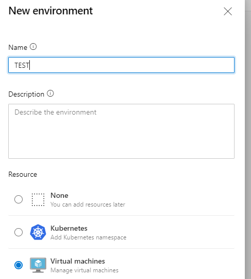

Azure Devops makes it extremely easy to deploy to cloud-native services. Azure is expectedly the easiest to deploy to but Kubernetes or even AWS and GCP are not very hard to set up. 

Microsoft introduced deployment support for VMs a while back. But making it work involved trawling trough several docs so this blog post brings it all together. 

# Objective: Deploy a Windows Service to an on-premises VM using only Azure DevOps
Given the code for an Windows Service we want dto deploy a service to 2 environments. In this case they are named CORP and PROD. It could also be DEV, TEST and PROD or more complex topologies. 

Other solutions are available. [Octopus Deploy](https://octopus.com/) in particular is doing an excellent job in this space. 

# Set up Environment 
From Pipeline / Environment / New Environment, select "Virtual Machines"


It is then possible to copy a script to run on each VM. This script essentially downloads the Azure Devops agent and configures it for deployment. The main command is:
```powershell
.\config.cmd --environment --environmentname "TEST" --agent $env:COMPUTERNAME --runasservice --work '_work' --url 'https://myproject.visualstudio.com/' --projectname 'MyProject' --auth PAT --token <YOUR_PAT>
```

Configured machine appear in the environment:


# Set up pipeline 
```yaml
- stage: Deployment
  dependsOn: Build

  jobs:
  - deployment: DeployTEST
    displayName: 'Deploy to TEST'
    environment: 
      name: TEST
      resourceType: VirtualMachine ## required to tell AZDO to deploy to VMs. 

    strategy:
      runOnce:    #rolling, canary are the other strategies that are supported
        deploy:
          steps:
          - template: deploy-windows-service.yml
```


Full files:
<script src="https://gist.github.com/orecht/fa5e98694db9bdb6909ee0b52c280232.js"></script>
<script src="https://gist.github.com/orecht/e6d9b93b426942dbeeea2d49089ac172.js"></script>